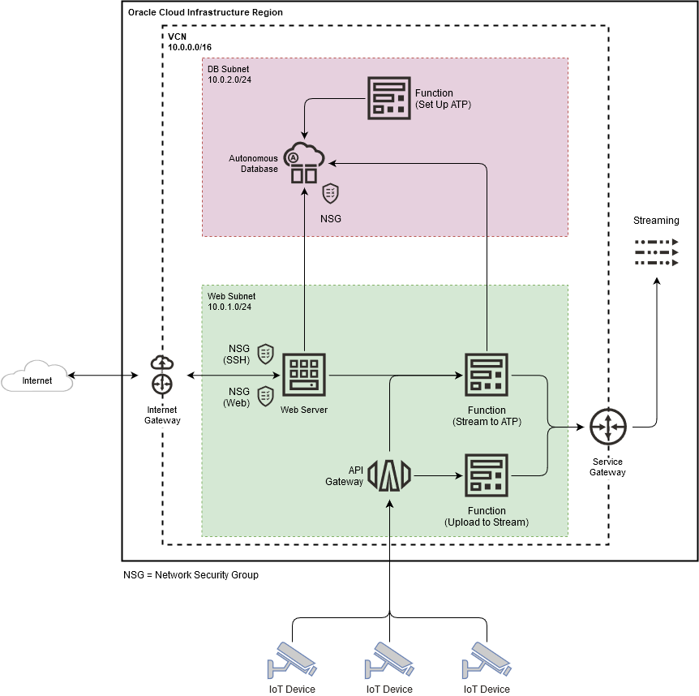

# oci-arch-iot-streaming

Deploy Oracle Cloud Infrastructure Streaming to support IoT devices data streams uploaded into the cloud at scale.

This reference architecture deploys OCI Streaming supported by OCI Functions and OCI API Gateway. Messages uploaded to the stream partition will be then consumed by the Functions and uploaded to OCI ATP Instance. Data from the database will be exposed via Flask-based webserver deployed on OCI compute instance.  

## Terraform Provider for Oracle Cloud Infrastructure
The OCI Terraform Provider is now available for automatic download through the Terraform Provider Registry. 
For more information on how to get started view the [documentation](https://www.terraform.io/docs/providers/oci/index.html) 
and [setup guide](https://www.terraform.io/docs/providers/oci/guides/version-3-upgrade.html).

* [Documentation](https://www.terraform.io/docs/providers/oci/index.html)
* [OCI forums](https://cloudcustomerconnect.oracle.com/resources/9c8fa8f96f/summary)
* [Github issues](https://github.com/terraform-providers/terraform-provider-oci/issues)
* [Troubleshooting](https://www.terraform.io/docs/providers/oci/guides/guides/troubleshooting.html)

## Clone the Module
Now, you'll want a local copy of this repo. You can make that with the commands:

    git clone https://github.com/oracle-quickstart/oci-arch-iot-streaming.git
    cd oci-arch-iot-streaming
    ls

## Prerequisites
First off, you'll need to do some pre-deploy setup for Docker and Fn Project inside your machine:

```
sudo su -
yum update
yum install yum-utils
yum-config-manager --enable *addons
yum install docker-engine
groupadd docker
service docker restart
usermod -a -G docker opc
chmod 666 /var/run/docker.sock
exit
curl -LSs https://raw.githubusercontent.com/fnproject/cli/master/install | sh
exit
```

Secondly, create a `terraform.tfvars` file and populate with the following information:

```
# Authentication
tenancy_ocid         = "<tenancy_ocid>"
user_ocid            = "<user_ocid>"
fingerprint          = "<finger_print>"
private_key_path     = "<pem_private_key_path>"

# SSH Keys
public_key_oci  = "<public_ssh_key_path>"
private_key_oci  = "<private_ssh_key_path>"

# Region
region = "<oci_region>"

# Compartment
compartment_ocid = "<compartment_ocid>"

# ATP passwords
atp_admin_password = "<ATP_admin_password>"
atp_password = "<ATP_appuser_password>"

# OCIR for functions
ocir_repo_name         = "functions"
ocir_user_name         = "<oci_user_name>"
ocir_namespace         = "<ocir_namespace>"
ocir_docker_repository = "<oci_region>.ocir.io"
ocir_user_password     = "<oci_user_auth_token>"

````

Deploy:

    terraform init
    terraform plan
    terraform apply

## Destroy the Deployment
When you no longer need the deployment, you can run this command to destroy it:

    terraform destroy

## ATP Private Endpoints Architecture



## Reference Archirecture

- [IoT_at_scale_with_OCI_Streaming](https://docs.oracle.com/en/solutions/.../index.html)
